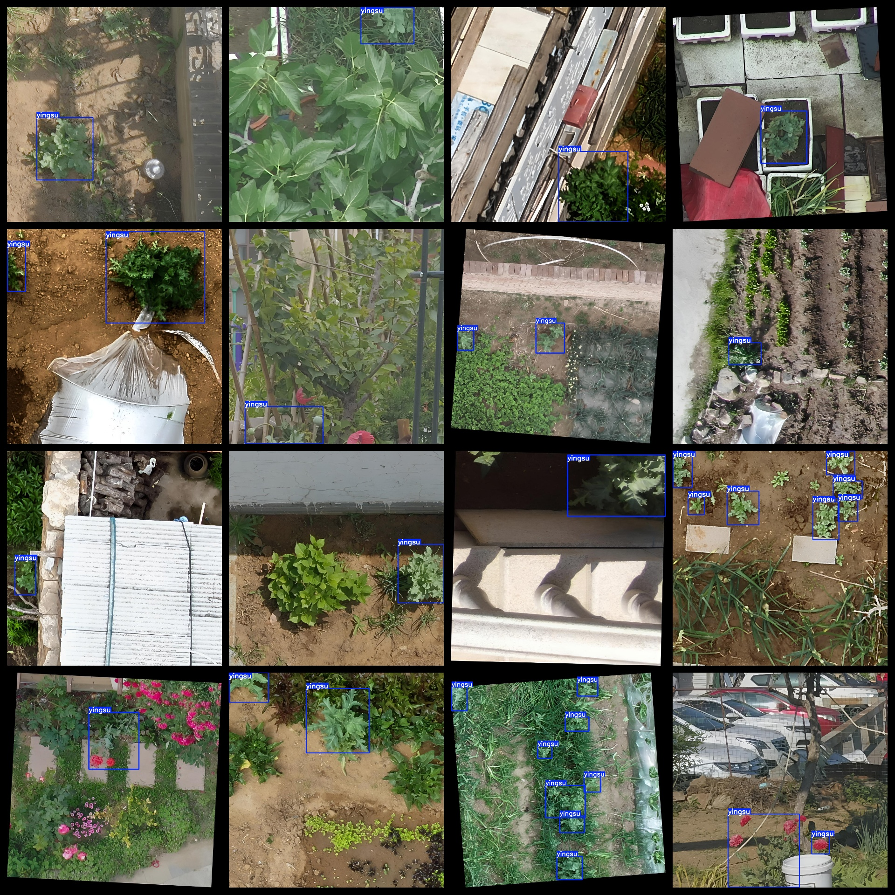

# UAV View Poppy Detection Dataset: 3648 images in VOC+YOLO format

The UAV View Poppy Detection Dataset consists of 3648 images in the VOC+YOLO format. This dataset follows the Pascal VOC format, but also includes YOLO-formatted text files (excluding split paths and only containing JPG images along with corresponding VOC-formatted XML files and YOLO-formatted txt files).

Number of images (JPG file count): 3648

Number of annotations (XML file count): 3648

Number of annotations (txt file count): 3648

Number of annotation categories: 1

Repository where the dataset is located: datasets_sl

Annotation category names: ["yingsu"]

Number of bounding boxes per class:

Number of bounding boxes for "yingsu": 6066

Total number of bounding boxes: 6066

Number of images each category occupies:

Number of images occupied by "yingsu": 3648

Image resolution: Images are of multiple resolutions, such as 1280x1280, 1018x1018, etc.

Annotation tool used: labelImg

Dataset enhancement status: No

Annotation rules: Draw bounding boxes around the categories

Important Note: The dataset does not have been split into training validation test sets; you will need to do this yourself.

Special Disclaimer: This dataset does not guarantee any accuracy in the trained models or weight files.

Annotation and image details are as follows:

## Images

---

Here is a pay link on Stripe (https://buy.stripe.com/3cs8yP7sY87d0vu9AB). Please contact me lonlonago@foxmail.com after funding $89, and I will send you a complete data files, thank you!

